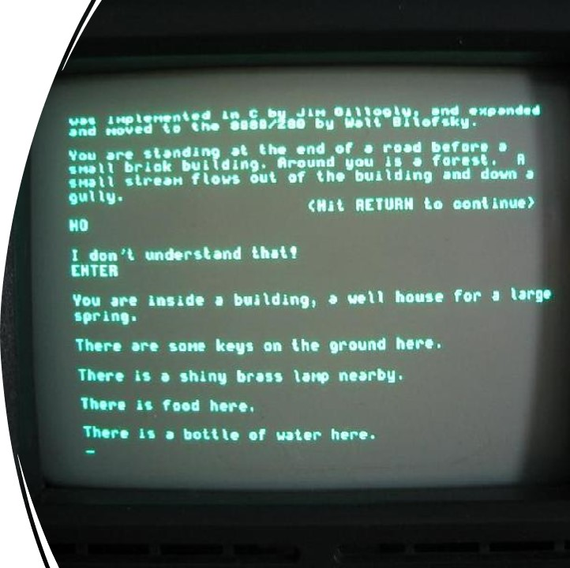
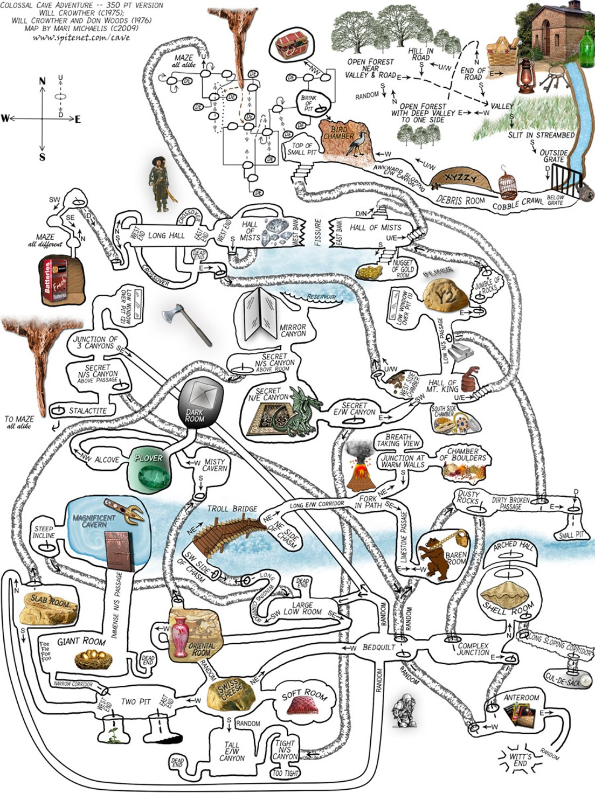
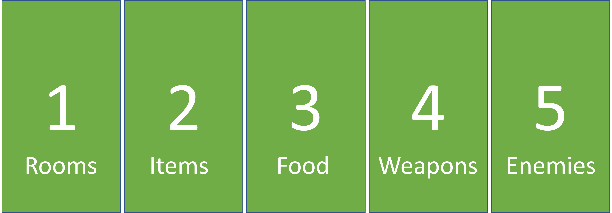
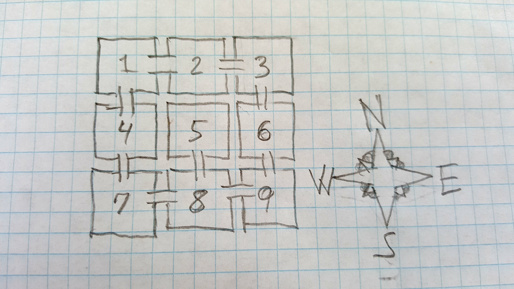
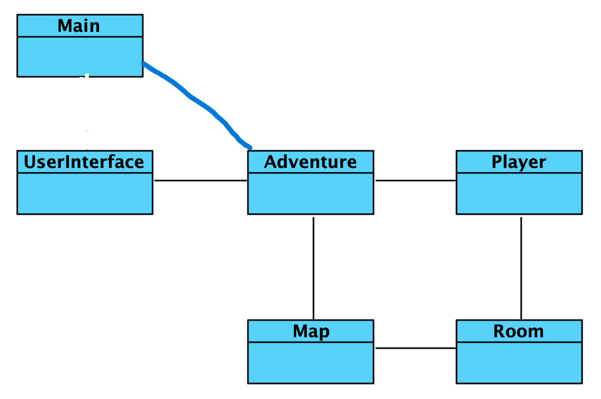

# Adventure Game
I skal kode som var det 1977. Altså tekstbaseret :-) 
Formålet er at arbejde med unit tests i et modulært og <b>testbart</b> kodedesign. 

### Hvad er jeres udgangspunkt:
- I har kun en tekst-terminal.
- Uden farver, grafik, mus og musik forekommer det nærmest umuligt at kode noget der bare er minimalt underholdende.
- Men i midten af 1970'erne lykkedes det alligevel Will Crowther at skabe et spil der både underholdt, inspirerede, og introducerede en masse mennesker til computerens fascinerende verden.
- Spillet hed Colossal Cave Adventure, og udkom fra 1977 og de næste mange år på stort set samtlige platforme.
- Det var opbygget som en interaktiv historie – meget lig det man ville opleve som deltager i en omgang Dungeons & Dragons, men med computeren som game master.

### Hvordan skal I arbejde:
- I skal udvikle jeres egen udgave af spillet <b>trinvist</b> på baggrund af det udleverede kodeskelet og en række medfølgende tests.
- I skal få de vedlagte tests til at virke - først "RoomTest", så "MapTest" og tilsidst "PlayerTest". Logisk nok i en trinvis opbygning af spillet: først skal der kunne lave rum, så et kort over rummene, og tilssdst skal spilleren kunne bevæge sig rundt i rummene.
- I bør ikke rette i tests, men selve programkoden skal ændres for at komme til at virke. 
- Lige nu kan I køre programmet fra main, og vælge kommandoerne HELP og EXIT uden at programmet crasher. Men der er mange metoder som skal ændres for at man kan bevæge sig rundt i spillet. I skal (i første omgang) ikke opfinde nye metoder, men få de eksisterende metoder implementeret, så tests virker.
- Det er vigtigere at I ender med godt kodedesign, der opfylder de specificerede tests, end at I når at bygge hele spillet. <b>Det er som udgangspunkt torsdagsopgaven at få de eksisterende tests til at virke</b>. 
- Det kan sagtens være I "kun" når at bygge kortet, så spilleren kan gå rundt og udforske rummene. Men ellers er næste trin, at det skal være muligt for spilleren at samle ting op (og måske efterlade dem igen).
- Der ligger to primære udfordringer i opgaven:
  - At forstå - og bygge videre på - andres kode
  - At skrive sin kode med udgangspunkt i eksisterende unit tests</i>. En slags Test-Driven Development. 
- Spillet skal altså udvikle sig vha. tests, der allerede er defineret og fungerer som kravspecifikation og designoplæg. 
- Nogle tests er <i>@Disabled</i>, dvs. de bliver ignoreret indtil I fjerner annotationen (det er tests om spilleren kan samle noget op i et rum).
- Når man kan gå rundt i rummene og man kan samle ting op, vil næste trin være at der findes mad og våben i rummene, hvor man kan spise mad og affyre våben. 
- Hvis I overhovedet kommer så langt (der er ikke lavet unit tests til denne del og I forventes ikke at kunne nå hertil på 1 dag), bør I gøre det simpelt for jer selv og lave én ting ad gangen, først mad. Altid først mad! 
- Spillet vil skulle udvides med nye kommandoer HEALTH og EAT. Spilleren skal have en form for health, som øges ved at spise (sund) mad og mindskes ved at spise gift og usund mad. Food kan oplagt være en subklasse til Item. Men hey - I har kun en dag til opgaven, så jeg regner ikke med at I kommer så langt! 
- Som I kan se af figuren nedenfor, vil det derefter være våben som skal kunne samles op, og bæres rundt som alle andre ting, men også "equippes" og være klar til brug. 
Spillet vil nu skulle udvides med nye kommandoer EQUIP og ATTACK og der skal laves en Weapon klasse (der arver fra Item) og som kan have egne arvinger, et RangedWeapon, der har et begrænset antal brug, før det "løber tør" og bliver ubrugeligt og et MeleeWeapon kan normalt bruges et utal af gange. Og selvfølgelig til slut en Enemy klasse, så der kan kæmpes!

- Men nu er I nok oppe på mere end en uges arbejde, så overvej at have det som skuffeprojekt ved siden af undervisningen. Men lov mig at skrive unit tests undervejs, så I holder et godt kodedesign. Her er det vigtigt at følge Single Resposibility princippet. I den udleverede kode, er der følgende klasser med hver sit ansvarsområde: 
- <b>Adventure</b> klassen styrer spillets flow.
- <b>UserInterface</b> klassen er den eneste som håndterer indlæsning og udskrift.
- <b>Map</b> klassen opretter rummene og kæder dem sammen - altså bygger hele spillets map. Den kaldes af Adventure klassen inden spillet går igang.
- <b>Adventure</b> klassen styrer selve spillet, men det bør ikke være dennes opgave at holde styr på hvor "spilleren" er, det må "spilleren" selv gøre. Derfor er der være en <b>Player</b> klasse.
- Der skal være et "Spiller" objekt, der kender sin position på spillepladen (hvilket rum spilleren er i). Det er ogspå det objekt der bør flytte "sig selv" rundt og tjekke om den ønskede retning overhovedet er muligt.
- <b>Room</b> klassen repræsentere et enkelt rum, og har tilknytning til op til fire andre rum (north, south, east og west).
- <b>Item</b> klassen er en genstand som kan være i rummet, eller i "spillerens" inventory, hvis vedkommende har samlet det op i et rum.

### Jeres mere simple map, som I skal bruge for at testene virker:

### Det udleverede kodedesignet, som I skal bygge videre på:

  
 
